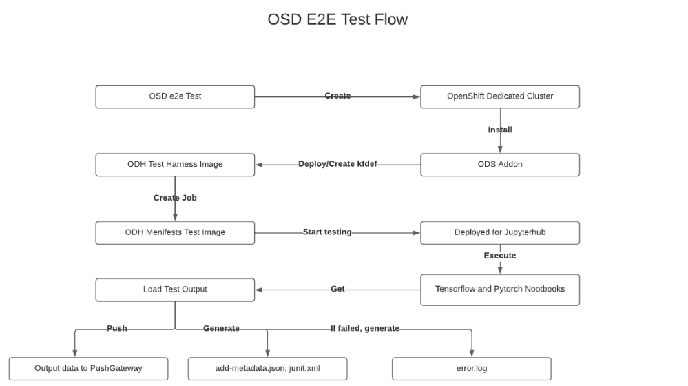

# Test Harness

## Description
This test will execute Tensorflow and Pytorch code in Jupyterhub Notebook from the ODS(Open Data Scientist) on OSD(OpenShift Dedicated).

*OSDE2E* will create a OSD cluster and install RHODS. Then, this **ODH Operator Test Harness** will wait until RHODS Jupyterhub is ready. When Jupyterhub route response 200 code, then it creates a job that will deploy odh manifests test image. At this moment, it only executes "jupyter_load" test script but it would be possible to extend for other test scripts too.

## How to BUILD/PUSH/TEST Jupyterhub Load Test?
Using Makefile, you can do 2 tests:
- **Job Test**
  - When odh manifest image updated, you should test the image works well first. This Job Test creates a Job object(odh manifest image) on the OSD cluster and verify if the odh manifest image works successfully.
- **Cluster Test**
  - When above job test has no issues, this Cluster Test verify if ODH Operator Test Harness Cluster Test works successfully.

### Pre-requisites
- **Setup Environment**
  ~~~
  git clone https://github.com/Jooho/operator-test-harness.git
  cd operator-test-harness

  # Create a SA/Rolebinding that has cluster-admin permission. It is for mimicking the acutal situation.
  # Because OSDE2E will deploy Test Harness Image with cluster-admin permission.
  make test-setup
  ~~~

- **Update TAG for test purpose**
  *DO NOT USE `latest` or `existing Tag`*
  ~~~
  # Update Makefile about the Image registry variable for test image
  $vi Makefile
  ...
  DEFAULT_IMAGE_REGISTRY=quay.io
  DEFAULT_REGISTRY_NAMESPACE=jooholee or your own registry
  DEFAULT_IMAGE_TAG=test        <=== Update
  ...
  ~~~

### Cluster Test
It will create a pod that is supposed to created by OSDe2e in the process. With this test, you can also easily check the output files that are requirements by OSDe2e test.
  
- Build Image
  ~~~
  make build
  ~~~

- Push Image
  ~~~
  make push-image
  ~~~

- Build/Push Image
  ~~~
  make image
  ~~~

- Test (for success)
  ~~~
  make cluster-test
  ~~~

- Test (for fail)
  ~~~
  vi template/odh-manifests-test-job.yaml
  - name: PUSHGATEWAY_URL
    value: "localhost:9091"

  make cluster-test
  ~~~

- Clean
  ~~~
  make cluster-test-clean
  ~~~

### Cluster Test Verify

- Check the log
  ~~~
  $ oc logs operator-test-harness-pod -f -c operator
  ~~~

- Check output files of the success test
  ~~~
  oc rsh operator-test-harness-pod 
  cd /test-run-results
  cat junit-odh-operator.xml
  cat add-metadata.json
  ~~~

- Check output files of the fail test
  ~~~
  oc rsh operator-test-harness-pod 
  cd /test-run-results
  cat junit-odh-operator.xml
  cat add-metadata.json
  cat error.log
  ~~~
